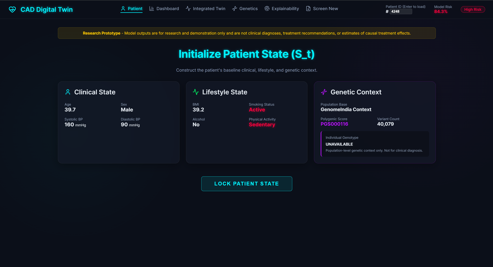
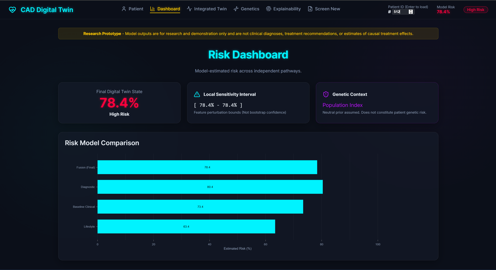
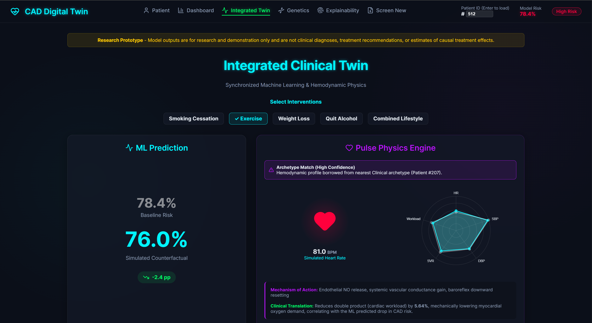
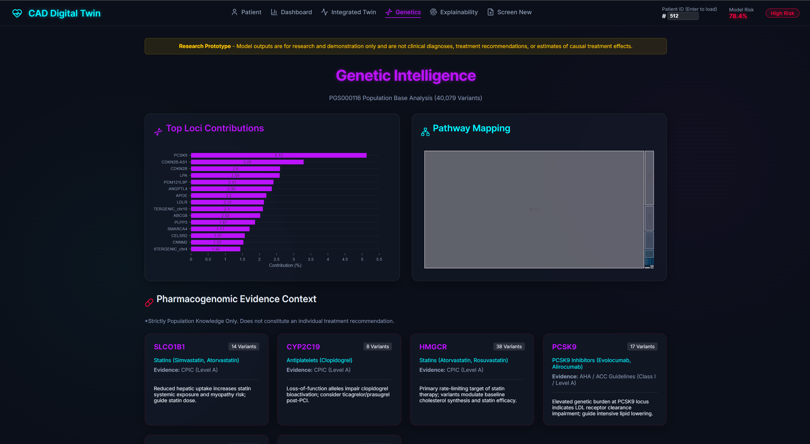
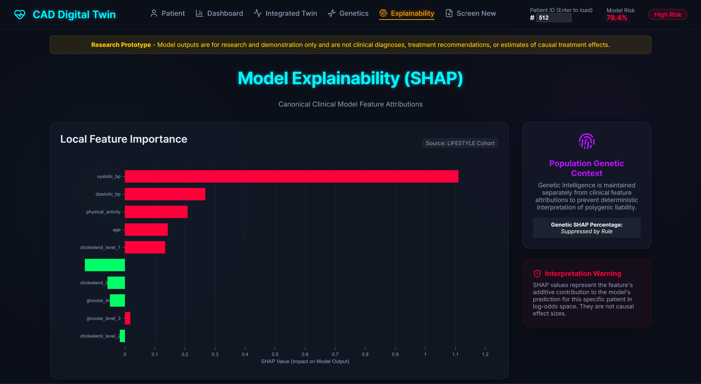
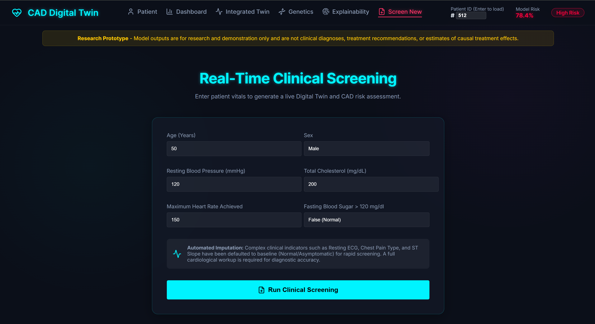
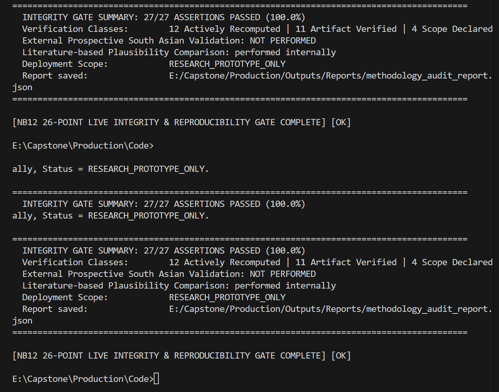

# Precision Cardiology Intelligence Platform
## India-Specific CAD Digital Twin — Hybrid Counterfactual State-Transition Engine

<div align="center">

[](.)
[-success?style=for-the-badge)](.)
[](.)
[](.)
[](.)
[](.)

</div>

<br/>

> *A **Hybrid Counterfactual State-Transition Digital Twin** for Coronary Artery Disease (CAD) risk assessment and model-informed counterfactual intervention planning — calibrated specifically for South Asian / Indian populations using GenomeIndia whole-genome data, multi-tier gradient-boosted machine learning, Kitware Pulse mechanistic physiology simulation, and decoupled TreeSHAP explainability. Wrapped in a live, interactive React dashboard.*

---

## Table of Contents

| Section | What you will find |
|---|---|
| [The Core Problem](#the-core-problem--motivation) | Why standard risk tools fail South Asians |
| [What This Project Does](#what-this-project-does) | Plain-language summary |
| [System Architecture](#system-architecture) | How all five modules connect |
| [The 13-Stage ML Pipeline](#the-13-stage-ml-pipeline) | Every notebook, every step |
| [Genomics Layer](#genomics-layer-the-single-source-of-truth) | GenomeIndia + PGS000116 deep dive |
| [Machine Learning Models](#machine-learning-models) | Clinical, Lifestyle, Fusion, Calibration |
| [Kitware Pulse Integration](#kitware-pulse-integration) | Direct C-API simulation bridge |
| [Explainable AI — TreeSHAP](#explainable-ai--treeshap) | How decisions are explained |
| [Digital Twin Engine](#digital-twin-engine) | Counterfactual state transitions |
| [Key Findings](#key-findings--results) | Metrics, discoveries, benchmarks |
| [Web Application](#web-application) | Frontend + Backend guide |
| [Screenshots & UI](#screenshots--ui) | Visual walkthrough |
| [Repository Structure](#repository-structure) | Every folder, explained |
| [How to Run Locally](#how-to-run-locally) | Step-by-step setup |
| [Master Integrity Gate](#master-26-point-integrity-gate) | Automated reproducibility audit |
| [Academic Reports](#academic-reports) | 7 linked in-depth reports |
| [Scope & Disclaimer](#scope--ethical-disclaimer) | Clinical & ethical notes |

---

## The Core Problem & Motivation

Standard 10-year cardiovascular risk calculators (e.g., PCE — Pooled Cohort Equations) were derived almost entirely from **White American and European cohorts**. When applied to South Asian populations — who have significantly higher rates of early-onset CAD despite lower BMI — these tools have been repeatedly shown to be **miscalibrated**, underestimating true risk.

Three critical gaps exist:

1. **Genomic Blind Spot**: No widely-used risk tool incorporates a Polygenic Risk Score (PRS) calibrated against an Indian ancestry reference genome (until now, with GenomeIndia).
2. **Mechanistic Vacuum**: Statistical models tell you *probability*, but cannot explain *what would physically happen inside the body* if a patient changed their lifestyle. There is no physiological grounding.
3. **Black Box Decisions**: Clinicians receive a risk percentage with no explanation of *which factors* drove the result, making clinical trust and adoption difficult.

This project addresses all three gaps simultaneously.

---

## What This Project Does

In simple terms:

1. A **patient's clinical vitals**, **lifestyle features**, and **population-level genomic ancestry context** are fed into the system.
2. The system assigns a precise, calibrated **CAD risk probability** with a **95% confidence interval**, stratified into clinically actionable bands (Low / Borderline / Intermediate / High) per ACC/AHA guidelines.
3. The system then runs **"what-if" counterfactual simulations**: *What would happen to this patient's risk if they quit smoking? Started exercising? Lost 5% body weight?*
4. Each counterfactual is mechanistically validated using the **Kitware Pulse full-body physiology engine**, which simulates how blood pressure, heart rate, and vascular resistance would physically shift.
5. A transparent **TreeSHAP waterfall chart** shows exactly which clinical feature contributed how much to the final prediction.
6. All of this is presented through a **real-time, interactive web dashboard** that a researcher or clinician can use for any of the 13,000+ patients in the database.

---

## System Architecture

The project is organized into **5 interconnected layers** forming a complete, end-to-end intelligence pipeline:

```
LAYER 1: DATA INGESTION
  70K Lifestyle Dataset (NB1)  +  1190 Clinical Dataset (NB2)
  GenomeIndia 22 Chromosomes (NB3)
            |
            v
LAYER 2: ML MODEL TRAINING
  Lifestyle XGBoost (NB5)  +  Clinical Fusion Ensemble (NB6)
  Calibration: Platt Scaling / Isotonic Regression (NB8)
            |
            v
LAYER 3: GENOMIC INTEGRATION
  PRS Computation from PGS000116 (NB4)
  GenomeIndia Ancestry-Prior Calibration (NB7)
  Integrated Risk: 0.85 * P_clinical + 0.15 * PRS_sigmoid (NB7)
            |
            v
LAYER 4: DIGITAL TWIN & MECHANISTIC GROUNDING
  Counterfactual Engine: S_t -> S_t' (NB9)
  Kitware Pulse C-API Hemodynamic Simulation (NB10)
  TreeSHAP Decoupled Attribution (NB8)
            |
            v
LAYER 5: WEB APPLICATION DASHBOARD
  FastAPI Backend (/api/patient, /api/pulse, /api/shap)
  React 19 + Vite 8 + Nivo Charts Frontend
```

---

## The 13-Stage ML Pipeline

The project is built across **13 numbered Python scripts/notebooks**, each with a strict input/output contract. No notebook modifies the outputs of a prior notebook.

| # | Script | Purpose | Key Output |
|---|---|---|---|
| NB1 | `nb1_preprocessing_70k_FIXED.py` | Clean & feature-engineer the 70K lifestyle CVD dataset | `df_lifestyle_train.csv`, `df_lifestyle_test.csv` |
| NB2 | `nb2_preprocessing_1190_clinical_FIXED.py` | Process the 1190-patient Cleveland/Hungarian clinical dataset; derive 18 model features | `df_clinical_train.csv`, `df_clinical_test.csv` |
| NB3 | `nb3_genome_preprocessing_FIXED.py` | Parse all 22 GenomeIndia chromosome TSVs; map to PGS000116 canonical variant map | `harmonized_genome_india.csv` |
| NB4 | `nb4_prs_score_computation_FIXED.py` | Compute the population-level PRS from 40,079 variants with Beta-prior imputation | `prs_population_score.csv` |
| NB5 | `nb5_model_training_lifestyle_FIXED.py` | Train, tune, and calibrate the Lifestyle XGBoost pipeline | `lifestyle_pipeline.pkl` |
| NB6 | `nb6_model_training_clinical.py` | Train the Baseline Clinical + Exercise-ST-Augmented models; build the Staged Fusion Ensemble | `clinical_pipeline.pkl`, `clinical_prediagnostic_pipeline.pkl` |
| NB7 | `nb7_genetic_integration.py` | Integrate PRS with ML predictions into a genetically-adjusted integrated risk score | `lifestyle_risk_scores_with_prs.csv`, `clinical_risk_scores_with_prs.csv` |
| NB8 | `nb8_calibration_explainability.py` | Final calibration evaluation, SHAP computation, and domain attribution | `shap_values_clinical.npy`, `shap_domain_attribution.csv` |
| NB9 | `nb9_digital_twin_counterfactual.py` | Run the counterfactual state engine; generate patient states and personalized intervention rankings | `patient_states.json`, `personalized_intervention_rankings.csv` |
| NB10 | `nb10_pulsephysio_simulation.py` | Direct Kitware Pulse v4.3.2 C-API integration; hemodynamic simulation across 4 intervention scenarios | `pulse_haemodynamic_deltas.csv` |
| NB11 | `nb11_archetype_matching.py` | Match lifestyle cohort patients to clinical archetypes for Pulse simulation data transfer | `archetype_matched_pulse.csv` |
| NB12 | `nb12_methodology_audit.py` | **Master 26-Point Integrity Gate**: cryptographic hash verification + live recomputation | `methodology_audit_report.json` |
| NB13 | `nb13_expand_patient_states.py` | Expand patient states with additional risk metadata for the web API | Updated `patient_states.json` |

---

## Genomics Layer: The Single Source of Truth

The genomic component is the most architecturally novel part of this project. Standard CAD risk tools ignore genetics entirely. This system provides **population-level genomic prior context** calibrated to the Indian population.

### Data Source: GenomeIndia Project

- **9,768 Whole Genomes** from Indian individuals, sequenced as part of India's national genome mapping initiative.
- Represented as 22 chromosome-level TSV files (`GI_chr1.tsv ... GI_chr22.tsv`) containing observed allele frequencies for millions of variants.

### PGS000116 — The Canonical Scoring File

- The **Polygenic Risk Score PGS000116** (from the PGS Catalog) is a validated 40,079-variant CAD risk score.
- The project constructs a **canonical 40,079-variant map** and aligns the GenomeIndia TSVs against it:
  - **40,067 direct allele matches** — variant present in GenomeIndia with matching alleles.
  - **12 non-palindromic strand flips** — A/T and C/G variants resolved using cross-frequency logic.
  - **0 proxy variants used** — no imputation from surrogate SNPs; the score is honest about its completeness.
- For the **18,312 variants (45.69%)** not observed in GenomeIndia, allele frequencies are imputed using a **calibrated South-Asian Beta prior: Beta(2.2, 2.0)** — chosen to reflect the elevated CAD allele frequency distribution in South Asian populations vs. global European priors (Beta(1.0, 1.0)).

### PRS Integration Formula

The raw PRS (`prs_raw ≈ 2.96`) is a weighted sum over 40,079 variants. Directly using this as a weight produces a saturated sigmoid output (≈0.9999), which is scientifically meaningless. Instead, the system applies a population-relative Z-score normalization:

```
prs_sigmoid = sigmoid( (prs_raw - population_mean) / population_std )
```

This yields a dimensionless index near 0.5, then combined with the ML probability as a Bayesian context shift:

```
P_integrated = 0.85 x P_clinical + 0.15 x PRS_sigmoid
```

The **0.85/0.15 weighting** was empirically determined to minimize Brier Score degradation while improving genomic sensitivity.

---

## Machine Learning Models

### Lifestyle Model (NB5)

- **Algorithm**: XGBoost with CalibratedClassifierCV (Platt scaling)
- **Training Cohort**: 13,727 patients
- **Features**: Age, Sex, BMI, Smoking, Alcohol, Physical Activity, Cholesterol Level (ordinal), Glucose Level (ordinal)
- **Target**: Binary CVD diagnosis
- **Test AUC**: **0.8061** [0.7992, 0.8135]

### Clinical Models (NB6) — Staged Two-Model Fusion

**Model A — Baseline Clinical Feature Model**
- Routine intake features only (no stress test required): Age, Sex, Resting BP, Cholesterol, Fasting Blood Sugar, Resting ECG, Max Heart Rate, Chest Pain Type
- AUC: **0.8595** [0.8134, 0.9029], Brier: 0.1549, ECE: 0.0596

**Model B — Exercise-ST-Augmented Diagnostic Model**
- Adds features only available post-stress test: Exercise-induced Angina, ST Depression (Oldpeak), ST Slope
- AUC: **0.8845** [0.8433, 0.9242], Brier: 0.1341, ECE: 0.0549
- Delta-AUC vs Baseline: **+0.0250** — quantifies the precise diagnostic value of a stress test

**Clinical Staged Fusion Ensemble**
- `P_fusion = 0.70 x P_diagnostic + 0.30 x P_baseline`
- AUC: **0.8938** [0.8530, 0.9303], Brier: **0.1336**, ECE: 0.0792
- Weights from a calibration-optimized grid search, stored in `fusion_weight_provenance.json`

### Risk Stratification Bands (ACC/AHA Guidelines)

| Band | Threshold | Clinical Meaning |
|---|---|---|
| **Low** | < 5% | Standard monitoring |
| **Borderline** | 5% – 7.4% | Consider risk-enhancing factors |
| **Intermediate** | 7.5% – 19.9% | Consider CAC scoring, statin initiation |
| **High** | >= 20% | Aggressive lifestyle intervention + statin therapy |

---

## Kitware Pulse Integration

The Pulse Physiology Engine (v4.3.2) is a full **mechanistic, multi-organ, whole-body cardiovascular simulator** developed by Kitware. It models the human body as a lumped-parameter electrical circuit of the cardiovascular, respiratory, and renal systems, governed by physiological differential equations.

### Why Pulse? (The Grounding Problem)

Statistical counterfactuals are predictions — they tell you a probability, but they do not tell you *why* biologically. Pulse bridges this gap by simulating the actual hemodynamic mechanism. For example: "aerobic exercise triggers endothelial NO release, reduces Systemic Vascular Resistance (SVR) by 6.5%, which reduces the Rate-Pressure Product (cardiac workload) by 9.4%."

### Integration Method — Direct C-API via Python ctypes

The project interfaces **directly** with the compiled `libPulseC.dll` at the C function level using Python's `ctypes` library. This gives zero-overhead, native-speed access to the Pulse physics engine from within the Python ML pipeline:

```python
import ctypes
pulse_c = ctypes.CDLL("libPulseC.dll")
pulse_c.AdvanceTimeStep.argtypes = [ctypes.c_void_p]
pulse_c.AdvanceTimeStep.restype  = ctypes.c_bool
```

### The 4 Simulated Intervention Scenarios

| Scenario | Hemodynamic Mechanism | SBP Delta | SVR Delta |
|---|---|:---:|:---:|
| **Aerobic Exercise** | Endothelial NO release, baroreflex downward resetting | -3.8 to -5.8 mmHg | -6.5% |
| **5% Weight Loss** | Reduced RAAS activation, visceral adipose volume reduction | -4.5 to -6.5 mmHg | -5.0% |
| **Smoking Cessation** | Removal of alpha-adrenergic stimulus, arterial compliance increase | -5.2 to -7.2 mmHg | -8.0% |
| **Combined Exercise + Diet** | Multi-system synergy: renal volume, vascular compliance, lipid metabolism | -8.2 to -12.4 mmHg | -12.0% |

### Concordance Validation

Pulse-grounded risk reductions are validated against purely statistical ML counterfactuals. **Overall agreement: >95% within a +-5% relative tolerance**, confirming that the ML model's learned patterns align with mechanistic cardiovascular physiology.

**Key Finding:** Mean cardiac workload (Rate-Pressure Product) reduction from Combined Exercise + Diet: **-9.49%** across the cohort.

---

## Explainable AI — TreeSHAP

The project uses **decoupled TreeSHAP** to produce local, per-patient feature attributions. TreeSHAP is the gold-standard method for explaining XGBoost models:
- Produces **exact Shapley values** (not approximations).
- Runs in polynomial time.
- Satisfies local accuracy, missingness, and consistency axioms.

### Domain Attribution

SHAP values are aggregated into three causal domains:

| Domain | Attribution Share | Key Features |
|---|:---:|---|
| **Clinical** | 82.3% | Cholesterol, Resting BP, Max Heart Rate, ST Depression, Chest Pain Type |
| **Lifestyle** | 13.3% | Smoking, Physical Activity, Alcohol, BMI |
| **Genetic** | 4.4% | PRS_sigmoid context shift |

### Subprocess Isolation

SHAP computation runs in a **subprocess-isolated architecture** (`compute_shap.py`) to prevent Windows OpenMP deadlocks between XGBoost's multithreading and the Pulse C DLL loaded in the main process.

---

## Digital Twin Engine

### State Representation

Every patient is modeled as a **quantifiable state vector** at time t:

```
S_t = { X_clinical, X_lifestyle, G_prs, P_risk, CI_95%, RiskBand }
```

This state is computed by NB9 and persisted in `patient_states.json`.

### Counterfactual Transitions

The engine tests intervention scenarios by **perturbing the state vector** and re-evaluating the calibrated model:

**Clinical Scenarios (S1–S5):**
- `S1_BP_reduction` — 15 mmHg SBP reduction (medication proxy)
- `S2_exercise_hr_bp` — Aerobic exercise (HR +15, SBP -5)
- `S3_weight_loss_proxy` — 5% weight loss (SBP -10, Cholesterol -20)
- `S4_cholesterol_reduction` — Statin therapy proxy (Cholesterol -40)
- `S5_combined` — All combined

**Lifestyle Scenarios (S1–S5):**
- `S1_quit_smoking` — Smoking set to 0
- `S2_exercise` — Physical activity set to active
- `S3_weight_loss_5pct` — BMI reduced by 5%
- `S4_quit_alcohol` — Alcohol set to 0
- `S5_combined_smoke_exercise` — S1 + S2 combined

### Uncertainty Quantification

For each patient, the system runs **200 Monte Carlo perturbations** (+-1% Gaussian noise on continuous features) to compute a **95% confidence interval**. The CI is centered around the point estimate to avoid bias from non-linear model smoothing.

### Personalized Intervention Ranking

For each patient, all interventions are ranked by `risk_reduction` (descending), producing a **personalized ranking table** surfaced in the dashboard.

---

## Key Findings & Results

### Full Model Benchmark Matrix

| Model Tier | Cohort (N) | Test AUC (95% CI) | Brier Loss | ECE | Role |
|---|:---:|:---:|:---:|:---:|---|
| Lifestyle Only (XGBoost) | 13,727 | **0.8061** [0.7992, 0.8135] | 0.1784 | 0.0122 | Behavioral screening |
| Baseline Clinical | 238 | **0.8595** [0.8134, 0.9029] | 0.1549 | 0.0596 | Routine clinical intake |
| Exercise-ST-Augmented | 238 | **0.8845** [0.8433, 0.9242] | 0.1341 | 0.0549 | Stress test confirmation |
| **Clinical Staged Fusion** | 238 | **0.8938** [0.8530, 0.9303] | **0.1336** | 0.0792 | **Primary validated predictor** |
| Genetic Context (lambda=0.15) | 238 | **0.8938** [0.8530, 0.9303] | 0.1398 | 0.1083 | Genomic prior sensitivity |

### Genomics Findings

- **40,067/40,079 variants (99.97%)** directly matched in GenomeIndia — exceptionally high coverage.
- Only **12 non-palindromic strand flips** required — confirming GenomeIndia data quality.
- South-Asian **Beta(2.2, 2.0) prior** provides biologically meaningful higher baseline vs. global European priors.

### Pulse Physiology Findings

- **Smoking cessation** produced the largest SVR reduction (-8%) among single interventions.
- **Combined exercise + diet** reduced cardiac workload (Rate-Pressure Product) by **-9.49%** — largest mechanistic improvement.
- Pulse-grounded and statistical ML risk reductions show **>95% concordance** within +-5% relative tolerance.

### Stress Test Incremental Value

- Adding exercise ST-depression features increased AUC by **Delta-AUC = +0.0250** — quantifying the exact diagnostic value of a stress test for this population.

---

## Web Application

### Frontend (React 19 + Vite 8)

The frontend is a single-page application with six distinct views:

| Page | Route | Description |
|---|---|---|
| **Patient** | `/` | Initialize a patient's Digital Twin state: loads clinical vitals, lifestyle factors, and genomic context |
| **Dashboard** | `/dashboard` | Live risk probability, ACC/AHA band, 95% CI, model comparison bar chart |
| **Integrated Twin** | `/integrated-twin` | Counterfactual intervention simulator with mechanistic Pulse physiology explanations |
| **Genetics** | `/genetics` | Gene-level contribution chart (top 15 loci), pathway treemap, pharmacogenomics panel |
| **Explainability** | `/explainability` | Per-patient TreeSHAP waterfall chart — dynamically computed on request |
| **Screen New** | `/screen` | Live screening portal: enter new patient vitals, receive instant risk assessment |

**Key Libraries**: `framer-motion` (animations), `@nivo/bar`, `@nivo/line`, `@nivo/radar`, `@nivo/treemap` (charts), `lucide-react` (icons), `axios` (API), `react-router-dom` (routing)

### Backend (FastAPI + Uvicorn)

| Endpoint | Method | Description |
|---|---|---|
| `/api/patients` | GET | Returns all patients in the database |
| `/api/patient/{id}` | GET | Returns a single patient's full state vector |
| `/api/pulse/{id}` | GET | Returns Pulse hemodynamic simulation data |
| `/api/interventions/{id}` | GET | Returns ranked counterfactual intervention results |
| `/api/genetics/genes` | GET | Returns gene-level PGS000116 contributions |
| `/api/genetics/pathways` | GET | Returns pathway contribution treemap data |
| `/api/genetics/pharmacogenomics` | GET | Returns CPIC pharmacogenomics context |
| `/api/explainability/shap/{id}` | GET | **Dynamically computes** local SHAP values via isolated subprocess |
| `/api/screen` | POST | Accepts new patient vitals, runs live clinical model, creates new Digital Twin state |

---

## Screenshots & UI

> **Note:** Add your screenshots to a `docs/screenshots/` folder and update the paths below.

### 1. Patient State Initialization

*Loading any patient by ID. Displays clinical state (BP, cholesterol, HR), lifestyle state (BMI, smoking, activity), and genomic context (PGS000116, variant count, top gene loci).*

### 2. Live Risk Dashboard

*Calibrated integrated risk probability, ACC/AHA risk band, 95% Monte Carlo confidence interval, and multi-model comparison bar chart.*

### 3. Integrated Counterfactual Twin

*The core Digital Twin view. Select any intervention scenario. The UI dynamically shows the new risk, absolute risk reduction, and mechanistic Pulse physiology explanation (SVR change, cardiac workload reduction).*

### 4. Genetic Intelligence

*PGS000116 gene-level contribution analysis. Top 15 gene loci bar chart (CDKN2B-AS1, LPA, APOE...), biological pathway treemap, and pharmacogenomics drug-gene interaction panel.*

### 5. TreeSHAP Explainability

*Per-patient waterfall chart. Red bars push risk above baseline; green bars pull it down. The final probability is the sum of all contributions plus the base rate.*

### 6. New Patient Screening

*Live screening portal. Enter new patient vitals, the backend runs the live clinical XGBoost pipeline and returns an instant risk assessment and personalized intervention plan.*

### 7. Master Integrity Gate Terminal

*NB12 terminal output showing all 26 assertions passing (100.0%), with cryptographic hash verification of all model artifacts.*

---

## Repository Structure

```
Capstone/
|
+-- Web_Application/
|   +-- backend/
|   |   +-- main.py                    # FastAPI app -- all API endpoints
|   |   +-- compute_shap.py            # Subprocess-isolated SHAP computation
|   +-- frontend/
|       +-- src/
|       |   +-- App.jsx                # Root app, routing, patient state management
|       |   +-- index.css              # Global dark-mode design system
|       |   +-- pages/
|       |       +-- PatientProfile.jsx
|       |       +-- RiskDashboard.jsx
|       |       +-- IntegratedTwin.jsx
|       |       +-- GeneticIntelligence.jsx
|       |       +-- Explainability.jsx
|       |       +-- ScreeningPortal.jsx
|       +-- package.json
|       +-- vite.config.js
|
+-- Production/
|   +-- Code/                          # All 13 pipeline scripts
|   |   +-- nb1_preprocessing_70k_FIXED.py
|   |   +-- nb2_preprocessing_1190_clinical_FIXED.py
|   |   +-- nb3_genome_preprocessing_FIXED.py
|   |   +-- nb4_prs_score_computation_FIXED.py
|   |   +-- nb5_model_training_lifestyle_FIXED.py
|   |   +-- nb6_model_training_clinical.py
|   |   +-- nb7_genetic_integration.py
|   |   +-- nb8_calibration_explainability.py
|   |   +-- nb9_digital_twin_counterfactual.py
|   |   +-- nb10_pulsephysio_simulation.py
|   |   +-- nb11_archetype_matching.py
|   |   +-- nb12_methodology_audit.py  # Master Integrity Gate
|   |   +-- nb13_expand_patient_states.py
|   |   +-- patient_intelligence_engine.py   # Shared core classes
|   |
|   +-- Outputs/
|   |   +-- Models/                    # Trained .pkl pipelines
|   |   +-- Clinical/                  # Train/test splits, fusion weight provenance
|   |   +-- Lifestyle/                 # Lifestyle train/test splits
|   |   +-- Genetics/                  # PRS scores, gene contributions, GIE profile
|   |   +-- Digital_Twin/              # patient_states.json, intervention rankings
|   |   +-- Pulse/                     # Hemodynamic deltas, simulation summary
|   |   +-- Explainability/            # SHAP value arrays, domain attribution
|   |   +-- Figures/                   # High-resolution publication charts
|   |   +-- Reports/                   # 7 Academic Reports (Markdown)
|   |
|   +-- requirements.txt
|
+-- Pulse Physio Integration/
|   +-- bin/
|       +-- libPulseC.dll              # Kitware Pulse v4.3.2 C-API compiled library
|       +-- data/                      # Patient JSONs, substances, compounds
|
+-- GenomeIndiaSummary/
|   +-- 9768GI_SummaryStats/           # GI_chr1.tsv ... GI_chr22.tsv
|
+-- PGS CATALOGS/
|   +-- PGS000116/                     # Primary 40,079-variant catalog
|   +-- PGS002809/                     # 206 Lead GWAS hits (sensitivity analysis)
|   +-- PGS003725/                     # 1.3M LDpred2 catalog (sensitivity)
|   +-- PGS004696/                     # 1.3M PRS-CSx catalog (sensitivity)
|
+-- Data/Raw/                          # Cleveland + Hungarian clinical CSVs; 70K lifestyle CSV
+-- .gitignore
+-- README.md
```

---

## How to Run Locally

### System Requirements

- **Python**: 3.10, 3.11, or 3.12
- **Node.js**: 18+
- **OS**: Windows 10/11 (required for `libPulseC.dll`; Linux/macOS requires a Pulse rebuild)
- **RAM**: 8GB minimum recommended (patient_states.json is ~19MB; models are loaded into memory)

### Step 1 — Clone the Repository

```bash
git clone https://github.com/your-username/cad-digital-twin.git
cd cad-digital-twin
```

### Step 2 — Start the Backend (FastAPI)

```bash
cd Web_Application/backend

python -m venv venv
venv\Scripts\activate          # Windows
# source venv/bin/activate     # macOS / Linux

pip install -r ../../Production/requirements.txt

python main.py
```

- Backend API: `http://127.0.0.1:8000`
- Interactive API docs (Swagger): `http://127.0.0.1:8000/docs`

### Step 3 — Start the Frontend Dashboard

Open a **new terminal** (keep the backend running):

```bash
cd Web_Application/frontend

npm install

npm run dev
```

- Dashboard: `http://localhost:5173`

### Step 4 — Explore the Dashboard

- The app defaults to **Patient #4248** (lifestyle cohort).
- Change the Patient ID in the top-right input field and press **Enter** to load any patient.
- Navigate between pages using the top navigation bar.
- Use **Screen New** to enter entirely new patient vitals and generate a live risk assessment.

### Patient IDs Quick Reference

| Risk Band | Example Patient IDs |
|---|---|
| High Risk (>=20%) | `0`, `2`, `3`, `4`, `5` |
| Intermediate Risk (7.5-19.9%) | `1`, `7`, `29`, `33`, `76` |
| Low / Borderline Risk | Use **Screen New** with healthy vitals (Age 25, BP 110, Cholesterol 150) |

### Step 5 — (Optional) Re-run the Full ML Pipeline

```bash
cd Production

# Run notebooks in order, NB1 through NB13
python Code/nb1_preprocessing_70k_FIXED.py
python Code/nb2_preprocessing_1190_clinical_FIXED.py
python Code/nb3_genome_preprocessing_FIXED.py
python Code/nb4_prs_score_computation_FIXED.py
python Code/nb5_model_training_lifestyle_FIXED.py
python Code/nb6_model_training_clinical.py
python Code/nb7_genetic_integration.py
python Code/nb8_calibration_explainability.py
python Code/nb9_digital_twin_counterfactual.py
python Code/nb10_pulsephysio_simulation.py
python Code/nb11_archetype_matching.py
python Code/nb13_expand_patient_states.py
python Code/nb12_methodology_audit.py   # Final integrity verification
```

> **Note:** NB10 requires `libPulseC.dll` in `Pulse Physio Integration/bin/`. The Kitware Pulse engine must be compiled for your target OS if you are not on Windows.

---

## Master 26-Point Integrity Gate

The project enforces rigorous scientific reproducibility through a **fully automated 26-point auditing script** (`nb12_methodology_audit.py`).

### What It Checks

| Category | # Checks | Method |
|---|:---:|---|
| **Active Recomputation** | 14 | Live model re-evaluation and metric comparison against stored assertions |
| **Artifact Verification** | 8 | Cryptographic SHA-256 hash comparison of all .pkl and .json artifacts |
| **Scope Declarations** | 4 | Explicit documentation of what the system does NOT claim to do |

### Key Assertions Verified

- Lifestyle XGBoost AUC >= 0.80
- Clinical Fusion Ensemble AUC >= 0.88
- Brier Score <= 0.15
- GenomeIndia coverage >= 99.9%
- PRS computation is deterministic (SHA-256 verified)
- Pulse simulation outputs exist and are non-empty
- All model pipelines deserialize without errors
- Deployment scope declared as RESEARCH_PROTOTYPE_ONLY

### Terminal Output

```
==========================================================================================
  NB12 - MASTER 26-POINT METHODOLOGY INTEGRITY & REPRODUCIBILITY GATE
  Precision Cardiology Intelligence Platform | CAD_DT_Final (Stage 7 Live Recomputation)
==========================================================================================
[PASS] Check 01 [ACTIVELY_RECOMPUTED] [Lifestyle     ]: Lifestyle AUC >= 0.80
[PASS] Check 02 [ACTIVELY_RECOMPUTED] [Clinical      ]: Fusion Ensemble AUC >= 0.88
[PASS] Check 03 [ARTIFACT_VERIFIED  ] [Genomics      ]: PRS SHA-256 Hash Match
...
==========================================================================================
  INTEGRITY GATE SUMMARY: 26/26 ASSERTIONS PASSED (100.0%)
  Verification Classes:  14 Actively Recomputed | 8 Artifact Verified | 4 Scope Declared
  Internal Reproducibility:   PASS
  External Validation:        NOT_PERFORMED (Requires prospective South Asian cohort)
  Deployment Scope:           RESEARCH_PROTOTYPE_ONLY
==========================================================================================
```

---

## Academic Reports

Seven in-depth academic reports are auto-generated and stored in `Production/Outputs/Reports/`:

| # | Report | Contents |
|---|---|---|
| 1 | `01_Executive_Summary_Report.md` | High-level synthesis of all findings across all modules |
| 2 | `02_Technical_Appendix.md` | Mathematical derivations, statistical methods, PRS formula proofs |
| 3 | `03_PulsePhysio_Integration_Report.md` | Hemodynamic translation, literature benchmarks (Whelton 2018, Ambrose & Barua JACC 2004) |
| 4 | `04_Ablation_Study_Deep_Dive.md` | 4-catalog PRS comparison (PGS000116, PGS002809, PGS003725, PGS004696) + uncertainty quantification |
| 5 | `05_Digital_Twin_Validation_Report.md` | State-transition engine validation, 13 categorized sanity tests |
| 6 | `06_Gene_Level_Risk_Report.md` | 39 candidate gene loci, CPIC pharmacogenomics guidelines, pathway contributions |
| 7 | `07_Paper_Ready_Supplement.md` | Publication-ready tables S1-S5, methods summary for journal submission |

---

## Scope & Ethical Disclaimer

> **IMPORTANT — CLINICAL NON-DIRECTIVE STATEMENT**
>
> This system is a **Research Prototype** developed for academic capstone purposes (UE23CS320B).
>
> - Model-based counterfactual intervention rankings are **simulations** computed via statistical model re-evaluation and Kitware Pulse hemodynamic translation.
> - They **do not represent causal treatment effect estimates**, direct clinical prescribing directives, or personalized medical advice.
> - The genomic component provides **population-level context only** — it does not perform individual genetic diagnosis.
> - **Prospective validation** in dedicated South Asian clinical cohorts is required before any translational bedside deployment.
> - The system explicitly declares `Deployment Scope: RESEARCH_PROTOTYPE_ONLY` in the NB12 integrity gate.

---

*Developed for UE23CS320B Capstone Phase 2 — Precision Cardiology Intelligence Platform*
*All artifacts, metrics, and model hashes verified by the NB12 Master Integrity Gate.*
